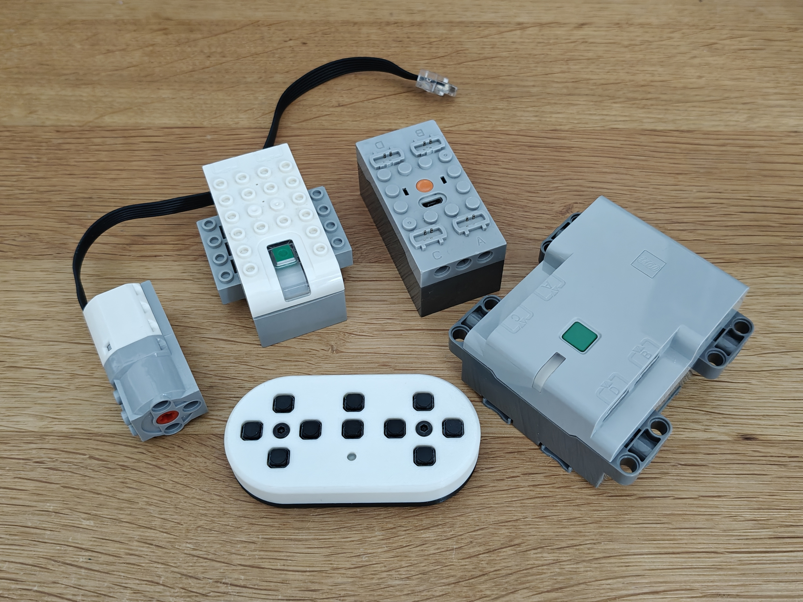
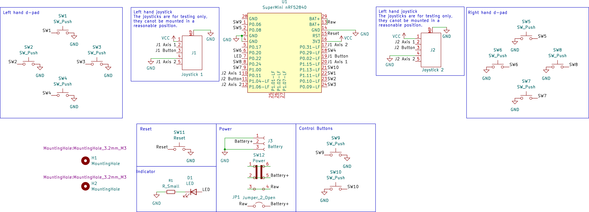

# QT-1

QT-1 is a ZMK based Lego remote, it also works as a keyboard - so it could be used as a remote for a TV too.

## Features

- ZMK studio support for remapping buttons
- Connect to up to 8 hubs at the same time
- Control up to 64 motors
- Motor speed control on a layer

## Hub compatability

QT-1 has been tested with the following hubs:
- WeDo 2.0 hub
- Lego PoweredUp! 4 port technic hub
- A 3rd party Power Functions hub (advertises as "JG_JMC-3D34")

I expect most other modern Lego hubs to work too.

## How to build

This is a DIY project, the idea is that you purchase PCBs from a manufacturer (JLCPCB, PCBWay etc..), 3D print the case and assemble it yourself. Details build instructions will follow at a later date.

You will need the following:
- Soldering iron
- Unleaded solder (this is a toy)
- Screwdriver to match the screws you choose

Bill of materials:

| Quantity     | Part                            | Description                                                                                                                             |
| ------------ | ------------------------------- | --------------------------------------------------------------------------------------------------------------------------------------- |
| 10           | [Alps SKPMAME010 switches](https://www.lcsc.com/product-detail/C115348.html)        | The main controller buttons. This variant has a low actuation force. Cheaper clones are available but may require more force to press.  |
| 1 (optional) | [B3U-1000P](https://www.lcsc.com/product-detail/C231329.html)                       | Optional reset button.                                                                                                                  |
| 1 (optional) | 0805 LED                        | Optional status LED.                                                                                                                    |
| 1 (optional) | 0603 Resistor (68-100ohm)       | Current limiting resistor for the status LED. The LED must not pull more than 15mA from the GPIO pin.                                   |
| 1            | Nice!Nano v2 or clone           | nrf52 based ProMicro form factor microcontroller board.                                                                                 |
| 2            | [4mm tall 1x12 pin header](https://www.aliexpress.com/item/4001122376295.html) | Needs to be 4mm to leave space for the battery, and for the USB socket to align.                                                        |
| 1            | 301230 battery with JST-PH plug | Lipo battery.                                                                                                                           |
| 1            | [S2B-PH-K](https://www.lcsc.com/product-detail/C19723656.html?)                        | 2 pin JST-PH socket.                                                                                                                    |
| 1 (optional) | [MSS22D18G2 125](https://www.lcsc.com/product-detail/C2906278.html)                  | Power switch                                                                                                                            |
| 1            | QT-1 PCB                        |                                                                                                                                         |
| 1            | 3D Printed case                 | FDM printed in PLA (mine were ordered from JLCPCB)                                                                                      |
| 2            | M3 5mm Heat-set insert          |                                                                                                                                         |
| 2            | M3 countersunk screw 10 or 12mm | These are visible from the front - consider coloured screws.                                                                            |
## Schematic

